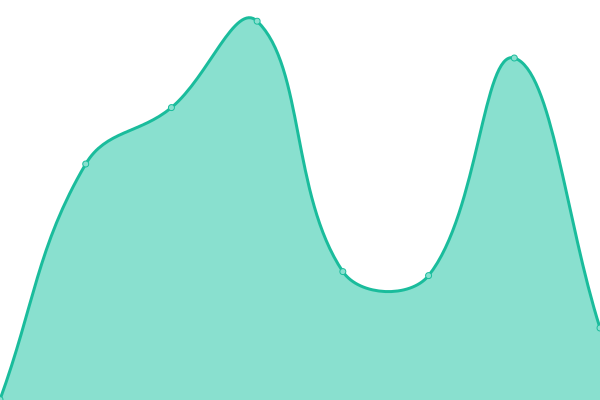

# [📈 Live Status](https://demo.upptime.js.org): <!--live status--> **🟧 Partial outage**

This repository contains the open-source uptime monitor and status page for [Abdullah Zahid](https://allshopia.com), powered by [Upptime](https://github.com/upptime/upptime).

With [Upptime](https://upptime.js.org), you can get your own unlimited and free uptime monitor and status page, powered entirely by a GitHub repository. We use [Issues](https://github.com/Hikarai/Status-Page/issues) as incident reports, [Actions](https://github.com/Hikarai/Status-Page/actions) as uptime monitors, and [Pages](https://demo.upptime.js.org) for the status page.

<!--start: status pages-->
<!-- This summary is generated by Upptime (https://github.com/upptime/upptime) -->
<!-- Do not edit this manually, your changes will be overwritten -->
<!-- prettier-ignore -->
| URL | Status | History | Response Time | Uptime |
| --- | ------ | ------- | ------------- | ------ |
|  [All Shopia Home](https://allshopia.com) | 🟩 Up | [all-shopia-home.yml](https://github.com/Hikarai/status-page/commits/HEAD/history/all-shopia-home.yml) | 

 3089ms
     
 | 

<a href="https://status.allshopia.com/history/all-shopia-home">99.70%</a>
    

|  [Product Collection](https://www.allshopia.com/collections/all) | 🟩 Up | [product-collection.yml](https://github.com/Hikarai/status-page/commits/HEAD/history/product-collection.yml) | 

 2648ms
     
 | 

<a href="https://status.allshopia.com/history/product-collection">99.70%</a>
    

|  [Shopping Cart](https://www.allshopia.com/cart) | 🟥 Down | [shopping-cart.yml](https://github.com/Hikarai/status-page/commits/HEAD/history/shopping-cart.yml) | 

 1420ms
     
 | 

<a href="https://status.allshopia.com/history/shopping-cart">99.70%</a>
    

<!--end: status pages-->

[**Visit our status website →**](https://demo.upptime.js.org)

## 📄 License

- Powered by: [Upptime](https://github.com/upptime/upptime)
- Code: [MIT](./LICENSE) © [Anand Chowdhary](https://anandchowdhary.com), supported by [Pabio](https://pabio.com)
- Data in the `./history` directory: [Open Database License](https://opendatacommons.org/licenses/odbl/1-0/)
